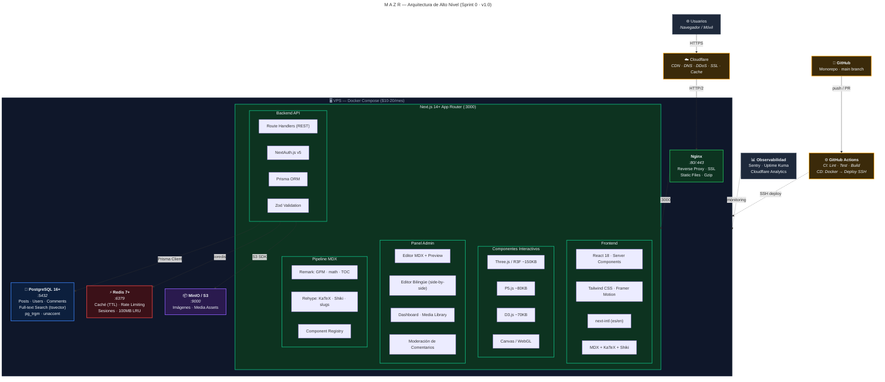

```mermaid
---
title: "M A Z R — Arquitectura de Alto Nivel (Sprint 0 · v1.0)"
---

graph TD
    %% ════════════════════════════════════════
    %% CAPA EXTERNA
    %% ════════════════════════════════════════

    USER["🌐 Usuarios<br/><i>Navegador / Móvil</i>"]
    CF["☁️ Cloudflare<br/><i>CDN · DNS · DDoS · SSL · Cache</i>"]

    USER -->|HTTPS| CF

    %% ════════════════════════════════════════
    %% VPS (DOCKER COMPOSE)
    %% ════════════════════════════════════════

    subgraph VPS["🖥️ VPS — Docker Compose ($10-20/mes)"]

        NGINX["<b>Nginx</b><br/><i>:80/:443</i><br/>Reverse Proxy · SSL<br/>Static Files · Gzip"]

        subgraph NEXTJS["Next.js 14+ App Router (:3000)"]
            direction TB

            subgraph FRONT["Frontend"]
                F1["React 18 · Server Components"]
                F2["Tailwind CSS · Framer Motion"]
                F3["next-intl (es/en)"]
                F4["MDX + KaTeX + Shiki"]
            end

            subgraph API["Backend API"]
                A1["Route Handlers (REST)"]
                A2["NextAuth.js v5"]
                A3["Prisma ORM"]
                A4["Zod Validation"]
            end

            subgraph INTER["Componentes Interactivos"]
                I1["Three.js / R3F ~150KB"]
                I2["P5.js ~80KB"]
                I3["D3.js ~70KB"]
                I4["Canvas / WebGL"]
            end

            subgraph ADMIN["Panel Admin"]
                AD1["Editor MDX + Preview"]
                AD2["Editor Bilingüe (side-by-side)"]
                AD3["Dashboard · Media Library"]
                AD4["Moderación de Comentarios"]
            end

            subgraph MDX["Pipeline MDX"]
                M1["Remark: GFM · math · TOC"]
                M2["Rehype: KaTeX · Shiki · slugs"]
                M3["Component Registry"]
            end
        end

        PG["🐘 <b>PostgreSQL 16+</b><br/><i>:5432</i><br/>Posts · Users · Comments<br/>Full-text Search (tsvector)<br/>pg_trgm · unaccent"]

        REDIS["⚡ <b>Redis 7+</b><br/><i>:6379</i><br/>Caché (TTL) · Rate Limiting<br/>Sesiones · 100MB LRU"]

        MINIO["📦 <b>MinIO / S3</b><br/><i>:9000</i><br/>Imágenes · Media Assets"]
    end

    CF -->|"HTTP/2"| NGINX
    NGINX -->|":3000"| NEXTJS

    API -->|"Prisma Client"| PG
    API -->|"ioredis"| REDIS
    API -->|"S3 SDK"| MINIO

    %% ════════════════════════════════════════
    %% CI/CD & OBSERVABILIDAD
    %% ════════════════════════════════════════

    GH["🐙 <b>GitHub</b><br/>Monorepo · main branch"]
    GA["⚙️ <b>GitHub Actions</b><br/><i>CI: Lint · Test · Build</i><br/><i>CD: Docker → Deploy SSH</i>"]
    OBS["📊 <b>Observabilidad</b><br/>Sentry · Uptime Kuma<br/>Cloudflare Analytics"]

    GH -->|"push / PR"| GA
    GA -.->|"SSH deploy"| VPS
    OBS -.->|"monitoring"| VPS

    %% ════════════════════════════════════════
    %% ESTILOS
    %% ════════════════════════════════════════

    classDef green fill:#0d3320,stroke:#10B981,stroke-width:2px,color:#F1F5F9
    classDef blue fill:#0c1f3d,stroke:#3B82F6,stroke-width:2px,color:#F1F5F9
    classDef red fill:#3b1118,stroke:#EF4444,stroke-width:2px,color:#F1F5F9
    classDef violet fill:#2a1a4e,stroke:#8B5CF6,stroke-width:2px,color:#F1F5F9
    classDef amber fill:#3b2a0a,stroke:#F59E0B,stroke-width:2px,color:#F1F5F9
    classDef slate fill:#1E293B,stroke:#334155,stroke-width:1px,color:#F1F5F9
    classDef nginx fill:#0d3320,stroke:#22C55E,stroke-width:2px,color:#F1F5F9
    classDef vps fill:#0F172A,stroke:#1E293B,stroke-width:2px,color:#94A3B8

    class NEXTJS,FRONT,API,INTER,ADMIN,MDX green
    class PG blue
    class REDIS red
    class MINIO violet
    class CF,GH,GA amber
    class USER,OBS slate
    class NGINX nginx
    class VPS vps
```
